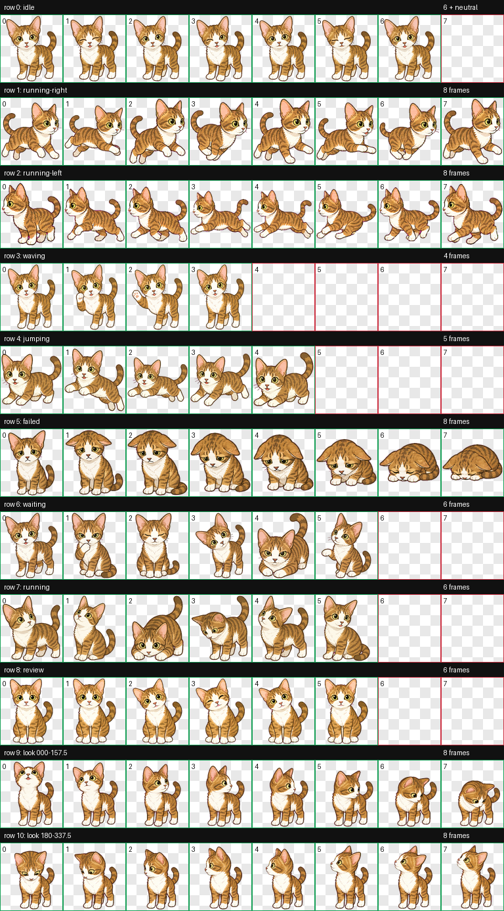

# 之之 Windows 桌面电子宠物

这是以之之为原型制作的独立 Windows 10/11 x64 桌面宠物。启动后，之之会在当前显示器的任务栏上沿缓慢左右散步，到达边缘自然转身；走一段时间后才会停下来休息。没有站立左右摆手舞蹈，也没有连续动作编排。

程序完全离线运行，不读取屏幕、键盘、剪贴板、浏览器或其他应用，不联网、不包含 AI、账号、遥测和广告。设置仅保存在当前用户的 Tauri 应用配置目录中。

源代码采用 MIT 许可证；之之的宠物美术与预览图不包含在该授权中，版权归之之家人所有。



## 使用

双击 `ZhizhiPet-Portable-0.1.0.exe` 可以免安装运行；也可以运行 `ZhizhiPet-Setup-0.1.0.exe` 安装到当前用户，无需管理员权限。

单击之之会随机播放一次很短的挥爪、轻跳或坐下互动，结束后继续原状态。拖动可以改变位置；行走模式下松手后会吸附到当前显示器工作区底部并在 1.5 秒后继续散步，暂停模式下会保留拖放位置。右键之之或打开系统托盘，可以暂停/继续、切换 80%/100%/125% 尺寸、切换开机启动、重置位置、查看关于信息或退出。

## Windows 下载与校验

首版是个人未签名构建，Windows SmartScreen 可能显示“未知发布者”。请只下载你自己仓库的 GitHub Actions artifact，并用 PowerShell 校验：

```powershell
Get-FileHash .\ZhizhiPet-Setup-0.1.0.exe -Algorithm SHA256
Get-FileHash .\ZhizhiPet-Portable-0.1.0.exe -Algorithm SHA256
```

结果应与同目录 `SHA256SUMS.txt` 完全一致。也可以把下载内容放进 `outputs/windows/`，在项目根目录运行：

```powershell
powershell -ExecutionPolicy Bypass -File .\scripts\verify-artifacts.ps1
```

## 从源码构建

需要 Node.js 22、pnpm 9、Rust stable 和 Windows WebView2。先运行逻辑测试：

```powershell
pnpm install --frozen-lockfile
pnpm test
pnpm typecheck
pnpm build
cd src-tauri
cargo fmt --check
cargo test --locked
cargo check --locked
cd ..
```

生成安装版与免安装主程序：

```powershell
pnpm tauri build --bundles nsis
```

安装程序位于 `src-tauri\target\release\bundle\nsis\`，原始 Windows 主程序位于 `src-tauri\target\release\ZhizhiPet.exe`。仓库内的 `.github/workflows/windows-build.yml` 会自动完成测试、编译、重命名、SHA-256 生成和 artifact 上传。

## 上传到已有的 zhizhicat 仓库

现有 `zhizhicat` 本地目录还有未提交的宠物图集更新，因此不要复制 `.git`、不要清空目录。项目已经提供安全整合脚本，它排除 `node_modules`、`dist` 和 Rust 编译缓存，不提交、不推送、也不删除现有文件。请从本项目目录执行：

```bash
./scripts/copy-into-zhizhicat.sh
cd ../outputs/zhizhi-codex-pet
git status --short
git add pet.json spritesheet.webp preview-contact-sheet.png preview-review.gif README.md windows-app .github/workflows/windows-build.yml
git commit -m "Add Zhizhi Windows desktop pet"
git push origin main
```

推送后，在 GitHub 仓库中打开 Actions，运行 `Build Zhizhi for Windows`。脚本放到仓库根目录的工作流已经配置为从 `windows-app/` 构建，无需手工改路径。

## 验收范围

当前 macOS 开发机已通过前端 25 项测试、Rust 10 项测试、TypeScript 检查、Vite 生产构建、`cargo fmt --check`、`cargo check`、完整 Tauri release 构建以及 5 秒原生启动检查。透明背景、任务栏贴边、多显示器、开机启动、单实例与 NSIS 安装包仍须由 Windows CI 和 Windows 10/11 真机完成最终验收。
